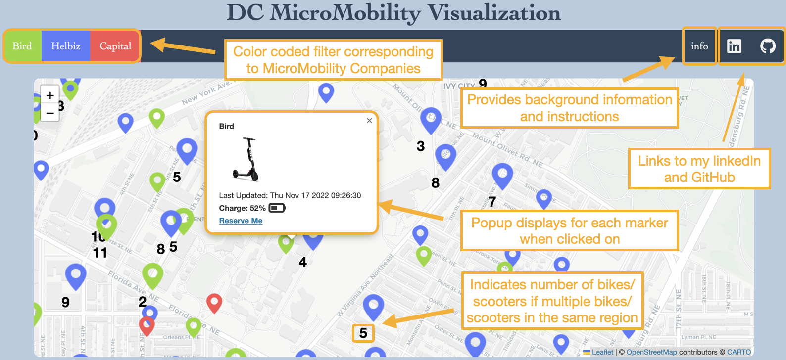

# DC Shared Micromobility Visualization

### Motivation
Cities often have the presence of companies that provide shared micromobility (bikes, scooters, etc.) services 
which provide users with an app to locate and rent their respective assets.  A slight inconvenience for users 
though is having to navigate through multiple apps if they want to locate bikes or scooters near them irrespective of the company they use.  This webpage consolidates API information on one map to allow the users to select the best option for them utilizing Washington, DC and 3 companies (Bird, Helbiz, Capital Bikeshare) as a case study demonstration.  

### Layout

### Technologies, Libraries, APIs
- **[Washington DC Dockless API](https://ddot.dc.gov/page/dockless-api)** to fetch live data of bicycles and e-scooters in Washington, D.C.
- **Leaflet Library** to style map and create interactive zoom features and clustering
- **Webpack** to bundle source JavaScript code
- **npm** to manage project dependecies

### Functionality
- Fetch data from 3 MicroMobility services comapnies (Bird, Helbiz, Capital Bikeshare) through the DC Dockless API
- View  and scroll map of DC with count of bicycles and e-scooters indicated
- Learn information of current location based on latest fetch and charge data for Bird scooters

